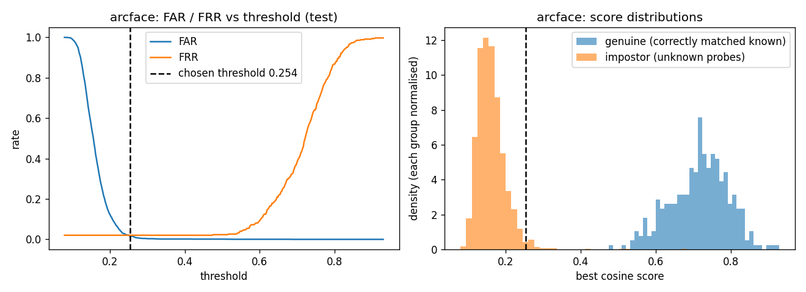
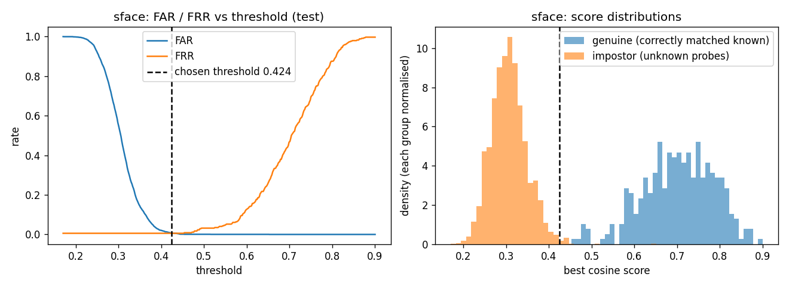
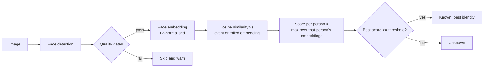
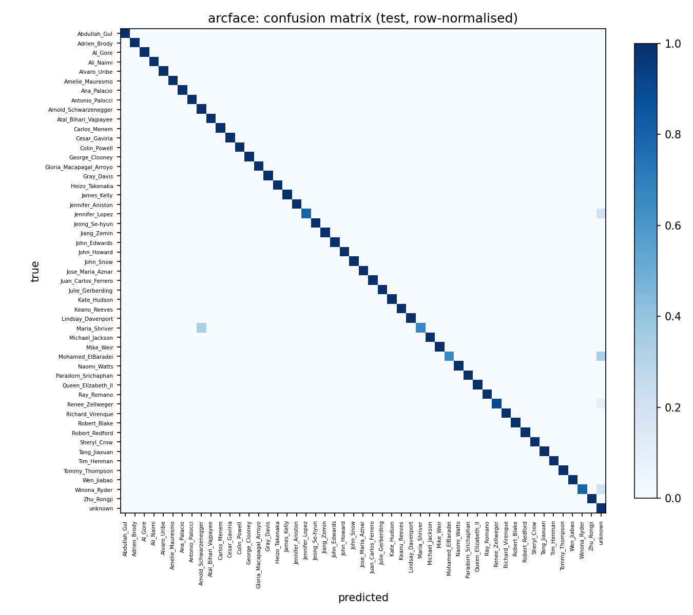

# Face Recognition Identification System

Enroll people, then identify new faces by matching them against the enrolled database, with an **"unknown" rejection** mechanism for people who were never enrolled. Built and evaluated on the **Labeled Faces in the Wild (LFW)** dataset using only free, open-source models .

Three face-recognition models run behind one common interface and are compared on the same data split:

| Role | Model | Detector | Embedding size |
|---|---|---|---|
| **Main (default)** | ArcFace (InsightFace `buffalo_l`) | SCRFD | 512 |
| Comparison | FaceNet (`facenet-pytorch`, VGGFace2 weights) | MTCNN | 512 |
| Comparison / fallback | SFace (OpenCV Zoo) | YuNet | 128 |

---

## Results at a glance

Evaluated **once** on a held-out test set, with each model's threshold chosen on a separate validation set (see [Evaluation protocol](#evaluation-protocol)). 345 known-person probes and 2,424 unknown-person probes. Brackets are 95% Wilson confidence intervals.

| Model | Threshold | Top-1 accuracy (no rejection) | False Reject Rate | False Accept Rate | Unknown rejection rate | Images with no usable face |
|---|---|---|---|---|---|---|
| ArcFace | 0.254 | 97.97% [95.87–99.01] | 2.03% [0.99–4.13] | 1.69% [1.25–2.29] | 98.31% | 0 |
| FaceNet | 0.659 | 97.39% [95.12–98.62] | 8.12% [5.67–11.48] | 1.57% [1.14–2.14] | 98.43% | 0 |
| SFace | 0.424 | **99.42%** [97.91–99.84] | **0.58%** [0.16–2.09] | **0.70%** [0.44–1.12] | **99.30%** | 0 |

All numbers come from `results/metrics.json`, written by the evaluation run.

**How to read this**

- **Threshold target:** every model's threshold was set so that at most **1% of unknown people** are accepted on the *validation* set (all three landed at 24/2424 = 0.99%). On the *test* set, SFace stayed below 1%, while ArcFace (1.69%) and FaceNet (1.57%) came out above it. Test FAR is reported as measured; the threshold was not adjusted afterwards.
- **FRR** counts a known person as a failure if they were rejected *or* matched to the wrong person.
- **ArcFace vs SFace:** ArcFace was chosen as the main model, but on this benchmark SFace scored as well or better on every metric. The difference in false-reject rate is only 7 vs 2 probes and the intervals overlap, so it is not conclusive. The FAR difference is larger and the intervals do not overlap.
- **FaceNet** ranks people well (top-1 97.39%), but its "same person" and "different person" scores overlap more, so hitting the same 1% FAR costs it many more false rejects (8.12%).

<p align="center">
  
  
</p>

---

## How it works



1. **Detection.** The model's own detector finds every face. Detectors run permissively (`DETECTOR_FLOOR = 0.3`) and the quality gates are applied afterwards, so weak detections are reported with a reason instead of silently disappearing.
2. **Quality gates.** A face is used only if its detection score is at least `MIN_DET_SCORE = 0.5` and its smaller side is at least `MIN_FACE_SIZE = 40` px. If several faces pass, the **largest** is used.
3. **Embedding.** Each model turns the face into a vector, which is L2-normalised so that cosine similarity is a plain dot product.
4. **Matching.** The query is compared with every stored embedding. A person's score is the **maximum** cosine similarity over their stored embeddings, because one good match is enough evidence when photos vary in pose and lighting.
5. **Unknown rejection.** If the best score is below the threshold, the result is `unknown`. An optional margin rule (reject when top-1 minus top-2 is smaller than `MARGIN = 0.05`) is implemented and **off by default** (`USE_MARGIN = False`), because it also rejects genuine faces when two enrolled people look alike.

**Database.** `FaceDB` stores one row per embedding (so a person can have several) and records which model produced them. Adding embeddings from a different model, or loading a database with a different model than it was built with, raises a clear `ModelMismatchError`, because embeddings from different models are not comparable. Re-adding the same source image for a person is ignored. Files are written atomically (temp file, then `os.replace`) so a crash cannot leave a corrupted database.

---

## Dataset

**Labeled Faces in the Wild (LFW)**: 13,233 face images of 5,749 people, one folder per person.

- Original release: Huang, Ramesh, Berg, Learned-Miller. *Labeled Faces in the Wild: A Database for Studying Face Recognition in Unconstrained Environments.* University of Massachusetts Amherst, Technical Report 07-49, 2007. Project page: <http://vis-www.cs.umass.edu/lfw/>
- **Download used in this project (figshare mirror of the original `lfw.tgz`):** <https://ndownloader.figshare.com/files/5976018>
- The download is verified against SHA-256 `055f7d9c632d7370e6fb4afc7468d40f970c34a80d4c6f50ffec63f5a8d536c0` before extraction.
- Images are read one at a time from folders (the folder name is the identity label), so the dataset is never loaded into memory at once.

Image counts per person, as printed by the notebook before the split is built:

| Images per person | People |
|---|---|
| 1 | 4,069 |
| 2 | 779 |
| 3–5 | 590 |
| 6–7 | 94 |
| 8–20 | 160 |
| more than 20 | 57 |

People with at least 8 images (217 of them) can be enrolled. People with 1–2 images (4,848 of them) form the pool of unknown people.

---

## Evaluation protocol

The split is done by **identity first, then by image**, and never lets enrollment images leak into the test set (this is asserted in code).

| Group | How it is built |
|---|---|
| **Enrolled people** | 50 people sampled with a fixed seed from the 217 who have at least 8 images |
| Enrollment images | 3 per person (150 embeddings in total) |
| Validation (known) | 2 images per person (100 probes) |
| Test (known) | the remaining images, capped at 10 per person (345 probes) |
| **Unknown people** | 4,848 people with 1–2 images, split *by person* into two halves: 2,424 for validation and 2,424 for test |

**Threshold selection.** For each model, the threshold is the lowest value at which at most 1% of the *validation* unknown probes are accepted. It is saved to `results/metrics.json`, and the test set is then evaluated once with that fixed value. The test set is never used to choose or adjust it.

**Metrics** (FAR and FRR are computed directly in code; scikit-learn is used only for the confusion matrix):

- **Top-1 accuracy**: closed-set, known probes, no rejection.
- **Correct-identification rate**: known probes accepted *and* matched to the right person.
- **FAR**: unknown probes accepted as some enrolled person.
- **FRR**: known probes rejected or misidentified. The wrong-ID and false-reject parts are also stored separately in `metrics.json`.
- **Unknown rejection rate**: unknown probes correctly rejected (1 − FAR).
- **Number of images with no usable face.**
- 95% **Wilson** confidence intervals, which behave better than the normal approximation for rates near 0% or 100%.

All three models run on the **same split**. Embeddings are cached per model on disk so reruns are fast.

---

## Failure cases

`results/failure_cases/` holds 10 annotated ArcFace test images (5 false accepts, 4 false rejects, 1 misidentification). Each image shows the true label, the predicted label, the score and the threshold, and a green box around the face that was actually used. They are the **worst** cases of each kind, not a random sample.

Patterns seen in the results:

1. **Photos with more than one face.** The system uses the *largest* face, which is not always the labeled person. In an earlier diagnostic run (on a larger 217-person split), three "unknown" photos were opened and inspected (Owen Wilson, Doug Duncan, Rosalyn Carter). Each contained a second, partly visible face, and the identities they were matched to (Jackie Chan, Charles Moose, Jimmy Carter) are people who appear alongside them. Many of the highest-scoring false accepts in the final run fit the same pattern of people who often appear together, for example Barbara Boxer matched to Gray Davis (score 0.683) and Sylvia Plachy matched to Adrien Brody (0.421). Only the three photos above were checked visually; the others are consistent with this explanation but were not verified one by one.
2. **Look-alike or related people.** In the ArcFace confusion matrix, Maria Shriver is sometimes matched to Arnold Schwarzenegger. They are married, so shared photos are the likely cause, but the images were not checked.
3. **People who are hard for every model.** Winona Ryder is partly rejected as unknown by all three models. That points to the photos (pose, occlusion, image quality) rather than one model, but this is a hypothesis, not a verified cause.
4. **Score overlap at the 1% FAR point (FaceNet).** Its genuine and impostor scores overlap, so many correct matches fall below the threshold (28 false rejects out of 345).
5. **Label noise in LFW.** Some "unknown" photos really contain an enrolled person, so a correct match is counted as a false accept. No threshold can fix that.

<p align="center">
  
</p>

---

## Design decisions

- **Split by identity, not by image**, so unknown people are truly unseen and the two unknown halves share no person.
- **Threshold chosen on validation only, then one pass over test**, so the reported numbers are not tuned on the data they are measured on.
- **Per-model thresholds.** Raw cosine scores are not comparable across models (FaceNet's same-person scores are not "higher" than ArcFace's in any meaningful sense), so each model is calibrated separately.
- **Max cosine per person**, not the mean, because photos of one person vary a lot.
- **One shared `select_face` rule** for enrollment, probes and the cache, so a face is never accepted in one place and rejected in another.
- **Fallback.** If InsightFace cannot be loaded, the system falls back to SFace so it still runs end to end. The database records the model, so a fallback can never silently mix embeddings.
- **Capped test probes (10 per person)** so a heavily photographed person such as George W. Bush (530 images) cannot dominate the rates.
- **Robust I/O:** images are decoded with `imdecode` (works with non-ASCII paths), unreadable images are logged and skipped, downloads use a temp file and a checksum, and all JSON and NumPy files are written atomically.

---

## Limitations

- **One split and one seed.** The FAR gap between the test and validation sets (for example ArcFace 0.99% vs 1.69%) is plausibly chance, but a single split cannot show that. Repeating with several seeds or cross-validation would give a more reliable estimate.
- **LFW is mostly well-lit celebrity photos** and is close to saturated for modern models, so these numbers do not predict performance on ordinary phone photos or surveillance images. The models' training data may also overlap with some LFW identities.
- **The threshold is tied to a 1% FAR target.** A different target gives a different trade-off (see the FAR/FRR curves in `results/`).
- **"Largest face wins"** is a simple rule and fails on group photos.
- **The test-probe cap** (10 per person) is a design choice not required by the task; setting `MAX_TEST_PER_ID = None` uses all remaining images.
- No blur detection: low-quality faces are only filtered by detection score and size.

## Possible improvements

- Return a result for **every** detected face instead of only the largest (or warn when several strong faces are present).
- Add a blur and pose quality check before enrolling or matching.
- Choose thresholds by cross-validation across several splits, and report a full ROC curve.
- Calibrate the optional margin rule (`MARGIN`) on the validation set and test whether it helps.
- Enroll more images per person and add **face alignment quality** filtering.
- Test on non-celebrity data with more realistic conditions.

---

## Getting started

The whole pipeline lives in the notebook `Face_Recognition_System.ipynb`.

1. Open it in **Google Colab** and select a GPU runtime (**Runtime → Change runtime type → T4 GPU**). It also runs on CPU, more slowly.
2. **Runtime → Run all.**

The notebook installs the dependencies, downloads and verifies LFW, downloads the model weights at runtime (never committed), runs smoke tests, evaluates all three models, and writes the plots, the failure cases and `results/metrics.json`. The first run takes roughly 10–20 minutes, mostly embedding about 5,400 images per model. Later runs are much faster because embeddings are cached.

**Reproducibility:** random seeds are fixed (`SEED = 42` for general use and `SPLIT_SEED = 0` for the split), so the same split is produced on every run.

### Enrolling and identifying

Using the notebook's functions:

```python
import json
from pathlib import Path

emb = get_embedder("arcface")                       # falls back to SFace if InsightFace is unavailable
db = FaceDB(emb.name, emb.dim)

# Enroll: the largest usable face in each photo (appends if the name already exists)
for path in ["alice_1.jpg", "alice_2.jpg", "alice_3.jpg"]:
    face, status = select_face(emb.detect_embed(load_image(Path(path))))
    if face is None:
        print(f"skipped {path}: {status}")          # no_face / low_score / too_small
        continue
    db.add("Alice", face.embedding[None], model=emb.name, sources=[path])

# Identify: unknown if the best score is below the calibrated threshold
thr = json.load(open("results/metrics.json"))["models"][emb.name]["test"]["threshold"]
probe, status = select_face(emb.detect_embed(load_image(Path("new_photo.jpg"))))
if probe is not None:
    m = db.match(probe.embedding, threshold=thr, top_k=3)
    print(m.identity or "unknown", round(m.score, 3), m.ranked)

db.remove("Alice")                                  # delete a person
db.save(Path("db.npz"))                             # atomic save; FaceDB.load(path, expected_model="arcface") reloads it
```

---

## Tech stack

Python, NumPy, pandas, OpenCV, scikit-learn, Matplotlib, tqdm, InsightFace 0.7.3 with ONNX Runtime GPU 1.22.0 (ArcFace and SCRFD), facenet-pytorch 2.6.0 with PyTorch (FaceNet and MTCNN), and the OpenCV Zoo ONNX models (YuNet and SFace). Everything is free and open source, and there are no API keys.

## Repository structure

```
.
├── Face_Recognition_System.ipynb   # full pipeline: setup, models, database, evaluation, plots
├── face_id_pipeline.py             # pipeline code as a Python file
├── results/
│   ├── metrics.json                # thresholds, split summary, all metrics with confidence intervals
│   ├── {arcface,facenet,sface}_scores.png      # FAR/FRR curves and genuine vs impostor histograms
│   ├── {arcface,facenet,sface}_confusion.png   # confusion matrices (test set)
│   └── failure_cases/              # 10 annotated failure images
└── .gitignore
```

Model weights, the LFW images and the embedding caches are downloaded or generated when the notebook runs and are not stored in the repository.

## Acknowledgements and references

- LFW dataset: Huang et al., UMass Amherst Technical Report 07-49 (2007).
- ArcFace: Deng, Guo, Xue, Zafeiriou, *ArcFace: Additive Angular Margin Loss for Deep Face Recognition*, CVPR 2019. Implementation: [InsightFace](https://github.com/deepinsight/insightface).
- FaceNet: Schroff, Kalenichenko, Philbin, *FaceNet: A Unified Embedding for Face Recognition and Clustering*, CVPR 2015. Implementation: [facenet-pytorch](https://github.com/timesler/facenet-pytorch).
- SFace and YuNet: [OpenCV Zoo](https://github.com/opencv/opencv_zoo).
